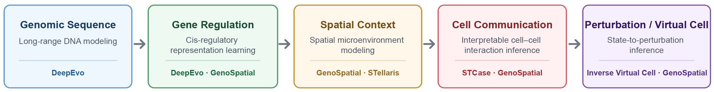

# Juntian Qi

Ph.D. Candidate in Bioinformatics at Peking University | AI for Biology & AI4Science

I develop deep learning models that connect genomic sequence, gene regulation, spatial context, cell–cell communication, and cellular perturbation.

  

This research pipeline summarizes the main trajectory of my work, from long-range genomic sequence modeling and gene regulation to spatial context, cell–cell communication, and perturbation-oriented virtual cell modeling.

My research focuses on building interpretable and multimodal AI systems for understanding how genomic information shapes cellular states and tissue organization.

## Selected Research

### DeepEvo
**Long-range genomic sequence modeling for regulatory evolution**

An interpretable deep learning framework for modeling ~180-kb genomic regulatory sequences and identifying cis-regulatory changes associated with cross-species gene expression evolution.

**Role:** First author · Method developer  
**Status:** Under review at *Nature Structural & Molecular Biology*  
**Code:** [Official Code](https://github.com/bbd0123/DeepEvo)

---

### STCase
**Interpretable spatial modeling of cell–cell communication**

An interpretable multi-view graph neural network framework for identifying niche-specific cell–cell communication from spatial transcriptomic data.

**Role:** First author · Method developer  
**Publication:** *Nature Computational Science* (2025)  
**Links:** [Paper](https://www.nature.com/articles/s43588-025-00809-6) · [Official Code](https://github.com/STCaser/STCase)

---

### GenoSpatial
**Multimodal modeling of genomic regulation and spatial cellular context**

A multimodal AI framework integrating genomic regulatory sequence, cell identity, spatial microenvironment, and cell–cell communication for spatial gene expression modeling and in silico perturbation.

**Role:** First author · Method developer  
**Status:** Manuscript in preparation · Code release in preparation

---

### Inverse Virtual Cell
**Inferring candidate perturbations from target cellular states**

A computational framework for identifying candidate upstream perturbations that may drive cells toward desired molecular states, with the goal of enabling inverse design of cellular phenotypes.

**Role:** Project lead · Method developer  
**Status:** Ongoing research

---

### STellaris
**Single-cell spatial mapping and spatial multi-omics reconstruction**

A computational and web-based framework for mapping single cells to spatial locations using spatial transcriptomics references and extending spatial information to multiple molecular layers.

**Role:** Co-first author  
**Publication:** *Nucleic Acids Research* (2023)  
**Links:** [Paper](https://academic.oup.com/nar/article/51/W1/W560/7177883?utm_source=chatgpt.com) · [Web Server](https://spatial.rhesusbase.com/?utm_source=chatgpt.com)

## Selected Publications & Manuscripts

- **Juntian Qi†**, Zhengchao Luo†, et al.  
  **[Interpretable niche-based cell–cell communication inference using multi-view graph neural networks](https://www.nature.com/articles/s43588-025-00809-6)**  
  *Nature Computational Science*, 2025.  
  **First author · Equal contribution**

- **Juntian Qi**, Shuhan Yang†, et al.  
  **DeepEvo deciphers the cis-regulatory grammar of human evolution to prioritize adaptive and disease drivers**  
  *Nature Structural & Molecular Biology*, under review.  
  **First author · Lead developer**

- **Juntian Qi**, et al.  
  **GenoSpatial integrates genomic sequence and spatial context to predict context-dependent gene expression**  
  Manuscript submitted.  
  **First author · Method developer**

- Xiangshang Li†, Chunfu Xiao†, **Juntian Qi†**, et al.  
  **[STellaris: a web server for accurate spatial mapping of single cells based on spatial transcriptomics data](https://academic.oup.com/nar/article/51/W1/W560/7177883)**  
  *Nucleic Acids Research*, 2023.  
  **Joint first author**

† Equal contribution.

## Technical Expertise

- **AI & Deep Learning:** long-range genomic sequence modeling, multimodal learning, graph neural networks, hypergraph neural networks, contrastive learning, attention mechanisms, and representation learning
- **AI for Biology:** gene regulation modeling, spatial microenvironment modeling, cell–cell communication, virtual perturbation, and inverse design of cellular states
- **Computational Biology:** single-cell RNA-seq, spatial transcriptomics, regulatory genomics, epigenomics, and cross-species transcriptomic analysis
- **Model Interpretation:** in silico sequence perturbation, regulatory variant interpretation, motif analysis, feature attribution, and biological hypothesis generation
- **Research Engineering:** Python, PyTorch, R, Scanpy/AnnData, HDF5, Linux, Git, and reproducible model training pipelines
